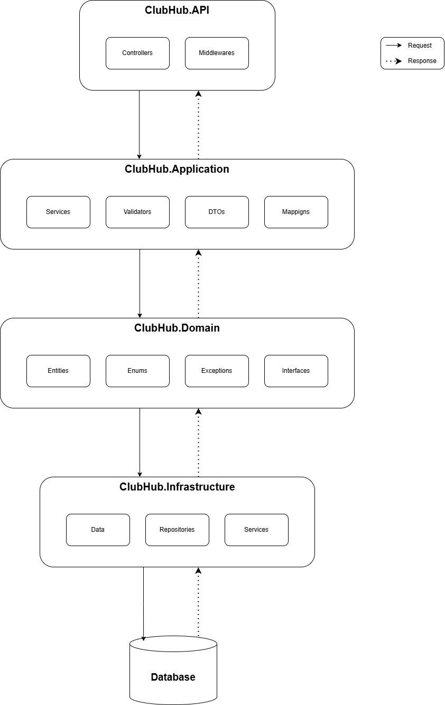

# ClubHub API

Hệ thống quản lý câu lạc bộ sinh viên bằng ASP.NET Core 8 Web API, SQL Server và EF Core Code First.

## Cách chạy

1. Tạo file `.env` trong `src/ClubHub.API/` với nội dung (xem `appsettings.json` để biết các key cần set):
```env
ConnectionStrings__DefaultConnection=Server=...;Database=ClubHub;...
Email__Username=your-email@gmail.com
Email__Password=your-app-password
```

2. Từ thư mục gốc của solution, chạy migration:

```bash
dotnet ef database update --project ClubHub.Infrastructure --startup-project src/ClubHub.API
```

3. Chạy API:

```bash
dotnet run --project src/ClubHub.API
```

Khi chạy ở môi trường Development, Swagger được mở ở route gốc của ứng dụng. Ngoài Development, Swagger không được bật.

## Kiến trúc tổng quan



## Cấu trúc project

```
ClubHub.Domain/
├── Entities/
│   ├── AuditLog.cs
│   ├── Club.cs
│   ├── ClubMember.cs
│   ├── ClubProposal.cs
│   ├── Event.cs
│   ├── EventRegistration.cs
│   ├── Feedback.cs
│   ├── Notification.cs
│   ├── PointTransaction.cs
│   ├── ProposalRevision.cs
│   └── User.cs
└── Enums/
    └── Enums.cs

ClubHub.Infrastructure/
├── Data/
│   ├── AppDbContext.cs
│   └── Migrations/
├── Repositories/
│   ├── GenericRepository.cs
│   ├── ClubRepository.cs
│   ├── ClubMemberRepository.cs
│   ├── EventRepository.cs
│   ├── EventRegistrationRepository.cs
│   ├── ProposalRepository.cs
│   ├── UserRepository.cs
│   ├── IGenericRepository.cs + interfaces
│   └── UnitOfWork.cs
└── Services/

ClubHub.Services/
├── DTOs/
│   ├── Auth/
│   ├── Club/
│   ├── Common/
│   ├── Event/
│   ├── Feedback/
│   ├── Membership/
│   ├── Notification/
│   ├── Point/
│   └── Proposal/
├── Services/
│   ├── Implementations/
│   │   ├── AuthService.cs
│   │   ├── ClubService.cs
│   │   ├── EventService.cs
│   │   ├── FeedbackService.cs
│   │   ├── MembershipService.cs
│   │   ├── NotificationService.cs
│   │   ├── PointService.cs
│   │   ├── ProposalService.cs
│   │   ├── AuditService.cs
│   │   ├── UserManagementService.cs
│   │   ├── AwsS3StorageService.cs
│   │   └── SmtpEmailService.cs
│   └── Interfaces/
└── Validators/
    └── PhoneValidator.cs

src/ClubHub.API/
├── Controllers/
│   ├── AuthController.cs
│   ├── ClubController.cs
│   ├── MembershipController.cs
│   ├── EventController.cs
│   ├── FeedbackController.cs
│   ├── PointController.cs
│   ├── ProposalController.cs
│   ├── StorageController.cs
│   ├── NotificationController.cs
│   ├── AuditController.cs
│   └── UniversityAdminController.cs
├── Middlewares/
│   └── ExceptionMiddleware.cs
├── Program.cs
└── appsettings.json
```

## API Endpoints

### Auth

Base route: `/`

| Method | Endpoint | Mô tả | Auth |
|--------|----------|-------|------|
| POST | `/register` | Đăng ký tài khoản (gửi OTP về email) | ❌ |
| POST | `/verify-email` | Xác thực email bằng OTP (sau đăng ký) | ❌ |
| POST | `/login` | Đăng nhập | ❌ |
| POST | `/refresh-token` | Làm mới access token | ❌ |
| PUT | `/change-password` | Đổi mật khẩu | ✅ |
| POST | `/forgot-password` | Gửi OTP đặt lại mật khẩu về email | ❌ |
| POST | `/reset-password` | Đặt lại mật khẩu bằng OTP | ❌ |
| GET | `/me` | Xem profile cá nhân | ✅ |
| PUT | `/me` | Cập nhật profile cá nhân (avatar, fullname, phone) | ✅ |

### Clubs

Base route: `/api/clubs`

| Method | Endpoint | Mô tả | Auth |
|--------|----------|-------|------|
| GET | `/` | Danh sách CLB (filter theo category, status, search; phân trang) | ❌ |
| GET | `/{clubId}` | Chi tiết CLB (kèm danh sách ClubAdmin) | ❌ |
| GET | `/my-clubs` | Danh sách CLB của tôi | ✅ |
| PUT | `/{clubId}` | Cập nhật thông tin CLB (logo, cover, description) | ✅ |

### Membership

Base route: `/api/clubs/{clubId}/members`

| Method | Endpoint | Mô tả | Auth |
|--------|----------|-------|------|
| POST | `/join` | Gửi đơn tham gia CLB | ✅ |
| DELETE | `/cancel-request` | Rút đơn tham gia (khi đơn còn pending) | ✅ |
| DELETE | `/leave` | Rời khỏi CLB | ✅ |
| GET | `/` | Danh sách thành viên | ✅ |
| GET | `/pending` | Danh sách đơn chờ duyệt | ✅ |
| PUT | `/requests/{membershipId}/review` | Duyệt hoặc từ chối đơn | ✅ |
| PUT | `/assign-role` | Gán vai trò thành viên trong CLB | ✅ |
| DELETE | `/{memberId}` | Xóa thành viên khỏi CLB | ✅ |
| PUT | `/transfer-admin` | Chuyển quyền ClubAdmin | ✅ |
| PUT | `/nominate-successor` | Đề cử người kế nhiệm | ✅ |
| PUT | `/accept-succession` | Chấp nhận kế nhiệm | ✅ |
| PUT | `/reject-succession` | Từ chối kế nhiệm | ✅ |

Base route phụ: `/api/my-memberships`

| Method | Endpoint | Mô tả | Auth |
|--------|----------|-------|------|
| GET | `/` | Lịch sử membership của chính mình | ✅ |

### Events

| Method | Endpoint | Mô tả | Auth |
|--------|----------|-------|------|
| GET | `/api/events?clubId=...` | Danh sách sự kiện (public, filter theo CLB, phân trang) | ❌ |
| GET | `/api/clubs/{clubId}/events` | Danh sách sự kiện của CLB | ❌ |
| GET | `/api/events/{eventId}` | Chi tiết sự kiện | ❌ |
| POST | `/api/clubs/{clubId}/events` | Tạo sự kiện (imageUrl, capacity, location...) | ✅ |
| PUT | `/api/events/{eventId}` | Cập nhật sự kiện | ✅ |
| DELETE | `/api/events/{eventId}` | Hủy sự kiện (soft delete, gửi thông báo) | ✅ |
| POST | `/api/events/{eventId}/register` | Đăng ký tham gia sự kiện | ✅ |
| DELETE | `/api/events/{eventId}/register` | Hủy đăng ký sự kiện | ✅ |
| POST | `/api/events/{eventId}/checkin/{userId}` | Check-in thành viên (+10 điểm) | ✅ |
| GET | `/api/events/{eventId}/registrations` | Danh sách người đăng ký | ✅ |
| GET | `/api/my-events` | Danh sách sự kiện của tôi (kèm ảnh event) | ✅ |

### Feedback

Base route: `/api/events/{eventId}/feedback`

| Method | Endpoint | Mô tả | Auth |
|--------|----------|-------|------|
| POST | `/` | Gửi feedback (rating 1-5, comment) (+2 điểm) | ✅ |
| GET | `/` | Xem tổng hợp feedback (avg rating + danh sách) | ✅ |

### Points

Base route: `/api/clubs/{clubId}/points`

| Method | Endpoint | Mô tả | Auth |
|--------|----------|-------|------|
| GET | `/me` | Xem điểm thi đua + rank trong CLB | ✅ |
| GET | `/leaderboard?page=1&pageSize=10` | Bảng xếp hạng (có thể lấy top 3 hoặc top 10) | ✅ |

### Proposals

Base route: `/api/proposals`

| Method | Endpoint | Mô tả | Auth |
|--------|----------|-------|------|
| POST | `/` | Nộp hồ sơ thành lập CLB | ✅ |
| PUT | `/{id}` | Sửa hồ sơ (khi đang Pending / NeedsRevision) | ✅ |
| PUT | `/{id}/resubmit` | Nộp lại hồ sơ sau yêu cầu bổ sung (lưu revision history) | ✅ |
| GET | `/my` | Xem danh sách hồ sơ của tôi | ✅ |
| GET | `/{id}` | Xem chi tiết hồ sơ | ✅ |
| GET | `/` | Xem tất cả hồ sơ (chỉ UniversityAdmin) | ✅ |
| PUT | `/{id}/review` | Duyệt (tự động tạo CLB + nâng role lên ClubAdmin) hoặc từ chối | ✅ |
| PUT | `/{id}/request-revision` | Yêu cầu bổ sung hồ sơ | ✅ |

### Storage

Base route: `/api/storage`

| Method | Endpoint | Mô tả | Auth |
|--------|----------|-------|------|
| POST | `/upload-image?folder=avatars\|clubs\|events\|proposals` | Upload ảnh lên AWS S3 (jpg/png/webp/gif, ≤5MB), trả về URL | ✅ |

### Notifications

Base route: `/api/notifications`

| Method | Endpoint | Mô tả | Auth |
|--------|----------|-------|------|
| GET | `/` | Danh sách thông báo của tôi (phân trang) | ✅ |
| GET | `/unread-count` | Số lượng thông báo chưa đọc | ✅ |
| PUT | `/{notificationId}/read` | Đánh dấu đã đọc | ✅ |
| PUT | `/read-all` | Đánh dấu tất cả đã đọc | ✅ |

### Audit Logs

| Method | Endpoint | Mô tả | Auth |
|--------|----------|-------|------|
| GET | `/api/clubs/{clubId}/audit-logs` | Lịch sử hoạt động của CLB | ✅ |
| GET | `/api/audit-logs/{entityType}/{entityId}` | Lịch sử hoạt động của entity cụ thể | ✅ |

### University Admin

Base route: `/api/admin`, yêu cầu role `UniversityAdmin`

| Method | Endpoint | Mô tả |
|--------|----------|-------|
| GET | `/users?role=...&page=...&pageSize=...` | Danh sách users (filter theo role, loại trừ UniversityAdmin, phân trang) |
| PUT | `/users/{userId}/status` | Cập nhật trạng thái tài khoản (Active/Inactive/Lock/Deleted) |
| GET | `/club-admins` | Danh sách user role ClubAdmin (để chọn khi tạo CLB) |
| GET | `/clubs?status=...&page=...&pageSize=...` | Xem toàn bộ CLB (filter trạng thái) |
| POST | `/clubs` | Tạo CLB trực tiếp (chọn ClubAdmin từ danh sách) |
| PUT | `/clubs/{clubId}/status` | Cập nhật trạng thái CLB |
| PUT | `/clubs/{clubId}/hide` | Ẩn CLB (Inactive) |
| PUT | `/clubs/{clubId}/lock` | Khóa CLB (Lock) |
| PUT | `/clubs/{clubId}/reopen` | Mở lại CLB (Active) |
| PUT | `/clubs/{clubId}/dissolve` | Giải tán CLB (Deleted) |
| DELETE | `/clubs/{clubId}` | Xóa mềm CLB |
| DELETE | `/clubs/{clubId}/hard` | Xóa cứng CLB |

## Phân quyền

Hệ thống dùng **Role hợp nhất** (không tách biệt SystemRole và ClubRole):

| Role | Mô tả |
|------|-------|
| `Student` | Sinh viên — mặc định khi đăng ký |
| `ClubMember` | Thành viên CLB (đã được duyệt vào CLB) |
| `ClubAdmin` | Quản trị CLB — được nâng lên khi duyệt hồ sơ hoặc được gán |
| `UniversityAdmin` | Quản trị viên trường — tài khoản seed mặc định |

## Ghi chú phát triển

- `Program.cs` tự động migrate database khi chạy ở Development.
- Tài khoản admin seed sẵn trong Development là `admin@gmail.com` với mật khẩu `12345`.
- API dùng CORS mở toàn bộ trong cấu hình hiện tại.
- OTP gửi qua SMTP (cấu hình `Email__Username`, `Email__Password` trong env).
- Upload ảnh qua AWS S3 (cấu hình `AWS__AccessKeyId`, `AWS__SecretAccessKey`, `AWS__BucketName` trong env).
- `Authorization` header chấp nhận cả 2 dạng: `Bearer {token}` hoặc `{token}` trần.
